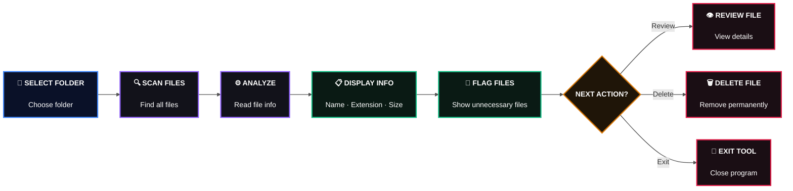

<div align="center">

<br>


<br><br>

</div>

---

## About

*A C++ utility for scanning, analyzing, and cleaning files inside a selected folder.*

Dead File Finder lets users select a folder, inspect the files inside it, analyze their basic properties, and decide which files should be kept or deleted.

<br><br>

---

## Features

* Select and validate any folder path from the computer
* Scan files and folders inside the selected location
* Display file name, extension, size, and word count
* Analyze files based on their basic properties
* Categorize files as empty, large, or normal
* Identify potential files worth reviewing
* Permanently delete a selected file
* Handle invalid paths and filesystem errors

<br><br>

---

## How It Works



<br><br>

---

## Built With

*C++ and Object-Oriented Programming applied to a practical file-system utility.*

<div align="center">

`C++`    `Object-Oriented Programming`    `Filesystem & File Handling`

</div>

<br><br>

---

## Run Locally

*Compile the project and run the utility directly from the terminal.*

**Clone the repository**

```bash
git clone <your-repository-url>
cd Dead_File_Finder
```

**Compile**

```bash
g++ -g src/main.cpp src/File.cpp src/Folder.cpp src/Scanner.cpp src/Analyzer.cpp -o main.exe
```

**Run**

```bash
.\main.exe
```

<br><br>

---

## What's Next

*Future updates will focus on making file analysis more useful while keeping the tool simple and practical.*

<br><br>

---

<div align="center">


</div>